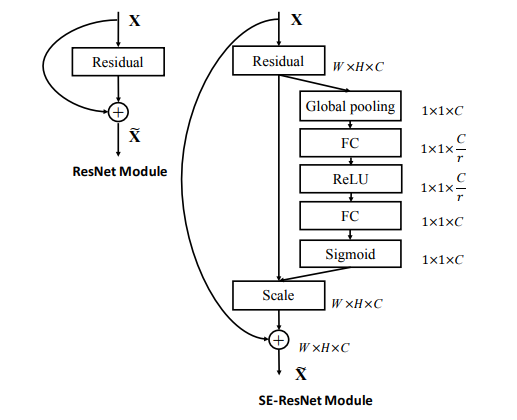

# SENet.mxnet
A MXNet implementation of Squeeze-and-Excitation Networks (SE-ResNext)

This is a [MXNet](http://mxnet.io/) implementation of Squeeze-and-Excitation Networks (SE-ResNext) architecture as described in the paper [Squeeze-and-Excitation Networks](https://arxiv.org/pdf/1709.01507v1.pdf) proposed by [Jie Hu](https://github.com/hujie-frank) et. al. They deployed this SE block in SENet and win the Imagenet 2017 classification task.

The author's caffe implementation can be found in his [repo](https://github.com/hujie-frank/SENet) on GitHub.

This is an illustration of a Squeeze-and-Excitation block.

The SE-ResNet module is implemented as followed:

The SE-ResNext 50 is implemented following this table:

This MXNet implementation is refered to [taki0112's](https://github.com/taki0112) [tensorflow version](https://github.com/taki0112/SENet-Tensorflow). I also refered a [PyTorch implementation](https://github.com/kuangliu/pytorch-cifar/blob/master/models/senet.py) from [kuangliu](https://github.com/kuangliu). BTW, I add a dropout layer before the last FullyConnected layer. I attach the training code if you want to train your own data with SE-ResNext architecture by yourself. 

#Requirements

Install MXNet(0.11.0) on GPUs mechine with NVIDIA CUDA 8.0, and it's better also installed with [cuDNN v6](https://developer.nvidia.com/cudnn) or later version (I'm not testing cuDNN v7).

#Data

ImageNet'12 dataset

Imagenet 1000 class dataset with 1.2 million images. Because this dataset is about 120GB, so you have to download by yourself. Sorry for this inconvenience.

#How to Train

For data preparation, you can refer [my pervious part of densenet](https://github.com/bruinxiong/densenet.mxnet) or you can also visit the repo of [Wei Wu](https://github.com/tornadomeet/ResNet). In his page, there is a very detailed information about how to prepare your data. 

When you finised data preparation, please make sure the data locates the same folder of source codes. You also need to change path of path_imgrec in line 84 and line 108 of train_xception.py. Then you can run the training cmd just like this (here, I use 4 gpus for training):

python -u train_se_resnext_w_d.py --data-dir data/imagenet --data-type imagenet --depth 50 --batch-size 192 --num-group 64 --drop-out 0.0 --gpus=6,7,8,9

Maybe you should change batch-size from 256 to 128 due to the memory size of GPU.

#How to retrain

When we want to train the large dataset and hope to change learning rate manually, or the machine is suddenly shutdown due to some reason, of course, we definitely hope we can continue to train model with previous trained weights. Then, your can use this cmd:

python -u train_se_renext_w_d.py --data-dir data/imagenet --data-type imagenet --depth 50 --batch-size 192 --num-group 64 --gpus=0,1,2,3 --model-load-epoch=50 --lr 0.001 --retrain

This means you can retrain your xception model from epoch 50 and change lr=0.001 using 4 GPUs.

#Training curves

The training procedure is ongoing. So, I hope anyone who are mxnet fun can test this code with me. When I finish, I will update more information about training and validation.

TO BE CONTINUE

SE-Resnet is coming soon.

Gluon version is coming soon.

#Reference

[1]  Jie Hu, Li Shen and Gang Sun. ["Squeeze-and-Excitation Networks"](https://arxiv.org/pdf/1709.01507v1.pdf) 

[2]  [Tensorflow implementation](https://github.com/taki0112/SENet-Tensorflow) of SENet from [taki0112's](https://github.com/taki0112)

[3]  [PyTorch implementation](https://github.com/kuangliu/pytorch-cifar/blob/master/models/senet.py)
